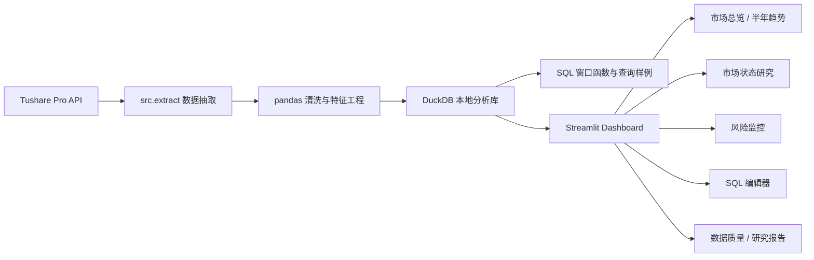

# A 股市场结构与资金风格分析终端

基于 Tushare、DuckDB、SQL、pandas、Plotly 和 Streamlit 构建的本地金融数据分析项目。项目围绕 A 股日行情、行业结构、市场宽度、资金流和个股风险监控展开，支持滚动数据抽取、交互式可视化、SQL 查询和研究指标输出。

## 功能概览

- 自动拉取最近约半年 A 股行情数据，默认滚动窗口为 180 天。
- 支持 sample data 模式，无 Tushare token 也可生成示例数据库。
- 使用 DuckDB 构建本地分析型数据库，核心宽表为 `analytics_market_daily`。
- Streamlit dashboard 覆盖市场总览、半年趋势、市场状态研究、风险监控、SQL 样例、数据质量、研究报告、行业透视、涨跌幅榜和个股明细。
- 内置 SQL 编辑器，可直接运行 `SELECT / WITH` 查询。
- 使用 SQL 窗口函数和 Python 滚动统计构建市场状态、行业拥挤度和风险监控指标。
- 支持 raw/processed Parquet 中间层、数据质量报告和 DuckDB 快照。
- 支持数据新鲜度监控、指数基准相对收益和风险预警分层。
- 支持风险预警表、行业透视表和研究报告下载。

## 项目架构



## 页面截图

可将截图放入 `docs/images/` 并在 README 中引用：

```text
docs/images/market_overview.png
docs/images/trend.png
docs/images/research.png
docs/images/risk_monitoring.png
docs/images/sql_examples.png
```

```markdown

```

## 数据来源

数据来自 Tushare Pro。当前项目主要使用：

- `stock_basic`：股票列表、行业、板块信息
- `daily`：股票日行情
- `moneyflow`：资金流数据，可选
- `limit_list_d`：涨跌停数据，可选
- `index_daily`：指数行情数据，可选，当前用于沪深300和中证500基准展示

Tushare token 通过本地 `.env` 或 Streamlit Secrets 配置，不应提交到代码仓库。

## Tushare 权限说明

不同 Tushare 账号的积分和接口权限不同。项目最低依赖接口：

- `stock_basic`
- `daily`

增强功能接口：

- `moneyflow`
- `limit_list_d`
- `index_daily`

如果增强接口不可用，抽取脚本会跳过对应数据，不影响行情、行业结构、趋势分析、风险监控和 SQL 查询功能。资金流、涨跌停、指数基准相关指标会根据可用数据自动展示或留空。

请求频率受限时可调大请求间隔：

```powershell
py -m src.extract --pause 0.5
```

首次运行可先拉较短窗口测试：

```powershell
py -m src.extract --days 30
```

## 技术栈

- Python
- SQL
- DuckDB
- pandas
- Plotly
- Streamlit
- Tushare Pro

## 项目结构

```text
app/
  streamlit_app.py

src/
  config.py
  database.py
  extract.py
  probe_tushare.py
  quality.py
  research.py
  risk.py
  tushare_client.py

sql/
  01_create_tables.sql
  02_analysis_queries.sql
  03_risk_monitoring_queries.sql
  04_factor_research_queries.sql

data/
  raw/          # 本地原始数据，已忽略
  processed/    # 本地处理数据，已忽略
  database/     # DuckDB 数据库，已忽略
  snapshots/    # DuckDB 快照，已忽略

.env.example
requirements.txt
README.md
```

## 快速开始

安装依赖：

```powershell
py -m pip install -r requirements.txt
```

复制 `.env.example` 为 `.env`，并填入 Tushare token：

```text
TUSHARE_TOKEN=your_tushare_token_here
```

拉取默认最近 180 天数据：

```powershell
py -m src.extract
```

生成 sample data：

```powershell
py -m src.extract --sample
```

启动 dashboard：

```powershell
py -m streamlit run app\streamlit_app.py
```

指定日期范围：

```powershell
py -m src.extract --start-date 20240601 --end-date 20240630
```

指定滚动窗口：

```powershell
py -m src.extract --days 120
```

如果 `py` 命令不可用，可以替换为 `python`：

```powershell
python -m src.extract
python -m streamlit run app\streamlit_app.py
```

## Dashboard 模块

- 市场总览：成交额、平均涨跌幅、上涨占比、涨停代理数、行业成交结构、市场温度评分。
- 半年趋势：成交额趋势、等权平均涨跌幅、上涨占比、涨停代理数、资金净流入趋势、市场温度评分趋势。
- 市场状态研究：20 日滚动 z-score、均值回归、AR(1) 半衰期估计、状态分层说明。
- 风险监控：异常涨跌幅、异常成交放量、高波动、20 日回撤、连续下跌天数、风险触发原因。
- SQL 样例：内置 SQL 编辑器，包含窗口函数、分组聚合、市场温度和行业拥挤度查询。
- 数据质量：展示抽取后的行数、日期范围、缺失率、重复键和数据新鲜度指标。
- 研究报告：生成市场状态摘要和指标解释。
- 行业透视：行业成交额、平均涨跌幅、上涨占比、资金流、行业拥挤度和轮动标签。
- 涨跌幅榜：当日涨幅榜和跌幅榜。
- 个股明细：按股票名称或代码检索。

## 核心指标

- 市场温度评分：基于成交活跃度、市场宽度、收益强度、涨停热度和风险控制的历史分位数加权评分。
- 市场宽度：上涨占比、涨停代理数、行业上涨分布。
- 交易活跃度：成交额、成交额 z-score、行业成交额占比。
- 行业拥挤度：行业成交额历史分位、成交额 z-score、相对 20 日收益。
- 相对收益：行业平均涨跌幅相对沪深300或中证500的超额表现。
- 风险指标：20 日波动率、20 日回撤、异常涨跌幅、异常放量、连续下跌天数、风险触发数量和风险等级。
- 研究指标：滚动均值、滚动标准差、z-score、AR(1) 半衰期。

## 数据产物

抽取脚本会生成以下本地数据产物：

- `data/raw/*.csv` 与 `data/raw/*.parquet`：接口原始返回数据。
- `data/processed/*.parquet`：处理后的宽表和指数基准数据。
- `data/database/market_analytics.duckdb`：本地 DuckDB 分析库。
- `data/snapshots/*.duckdb`：抽取完成后的 DuckDB 快照。

上述本地数据文件已通过 `.gitignore` 排除。

## SQL 示例

项目内置 SQL 文件位于 `sql/`。例如行业结构分析：

```sql
select
    coalesce(industry, '未分类行业') as industry,
    count(*) as stock_count,
    round(sum(amount_100m), 2) as turnover_100m,
    round(avg(pct_chg), 2) as avg_return,
    round(avg(case when is_up then 1 else 0 end), 4) as up_ratio
from analytics_market_daily
where trade_date = date '2026-06-12'
group by coalesce(industry, '未分类行业')
order by turnover_100m desc;
```

## 常见问题

### 1. 运行时报 Tushare token 缺失

确认本地 `.env` 文件存在，并写入：

```text
TUSHARE_TOKEN=your_tushare_token_here
```

### 2. 部分接口显示 skipped

通常代表当前 Tushare 账号没有该接口权限，或接口需要更高积分。项目会跳过 optional 数据源，不影响 `stock_basic` 和 `daily` 支撑的核心功能。

### 3. GitHub clone 后没有数据

本项目不会上传本地数据库和原始数据。clone 后需要自行运行：

```powershell
py -m src.extract
```

也可以使用 sample data：

```powershell
py -m src.extract --sample
```

### 4. SQLite 里找不到表

本项目使用 DuckDB，不是 SQLite。核心数据库文件位于：

```text
data/database/market_analytics.duckdb
```

页面内置 SQL 编辑器会直接连接 DuckDB 执行查询。

## 测试

```powershell
py -m unittest discover tests
```

## 隐私与安全

- 不要上传 `.env`。
- 不要上传 Tushare token。
- 不要上传本地 DuckDB 数据库文件。
- 不要上传 `data/raw/` 或 `data/processed/` 中的本地数据。
- 不要上传 `data/snapshots/` 中的本地数据库快照。
- `.gitignore` 已默认排除上述敏感或大体积文件。
