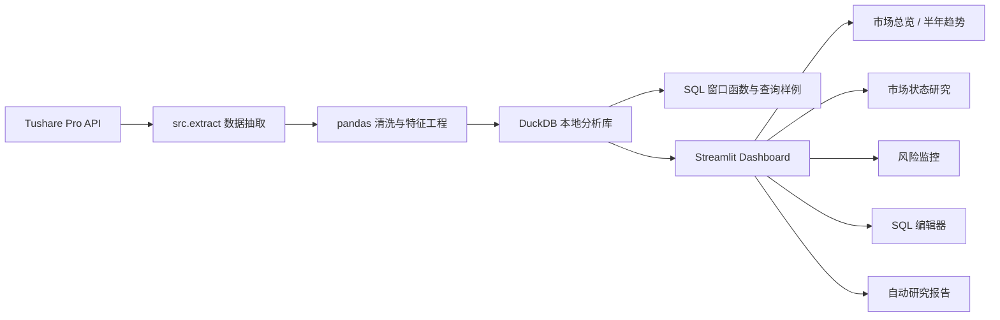

# A 股市场结构与资金风格分析终端

基于 Tushare、DuckDB、SQL、pandas、Plotly 和 Streamlit 构建的本地金融数据分析项目。项目围绕 A 股市场日行情、行业结构、资金流、市场宽度和个股风险监控展开，适合作为金融数据分析岗、风控数据岗、金融科技数据岗的作品集项目。

## 项目亮点

- 自动拉取最近约半年 A 股行情数据，默认滚动窗口为 180 天。
- 支持 sample data 模式，无 Tushare token 也可以快速体验 dashboard。
- 使用 DuckDB 构建本地分析型数据库，核心宽表为 `analytics_market_daily`。
- Streamlit 交互式 dashboard，覆盖市场总览、半年趋势、市场状态研究、风险监控、SQL 样例、研究报告、行业透视、涨跌幅榜和个股明细。
- 内置 SQL 编辑器，可直接在页面运行 `SELECT / WITH` 查询并展示结果。
- 使用 SQL 窗口函数和 Python 滚动统计构建风控与研究指标。
- 支持均值回归分析、滚动 z-score、AR(1) 半衰期估计、异常涨跌幅、异常成交放量、高波动和 20 日回撤监控。
- 支持风险预警表、行业透视表和自动研究报告下载。

## 项目架构



## 页面截图

建议在 GitHub 展示时补充以下截图到 `docs/images/`：

```text
docs/images/market_overview.png
docs/images/trend.png
docs/images/research.png
docs/images/risk_monitoring.png
docs/images/sql_examples.png
```

示例引用方式：

```markdown

```

## 数据来源

数据来自 Tushare Pro。当前项目主要使用：

- `stock_basic`：股票列表、行业、板块信息
- `daily`：股票日行情
- `moneyflow`：资金流数据，可选
- `limit_list_d`：涨跌停数据，可选

注意：Tushare token 存放在本地 `.env` 文件中，已通过 `.gitignore` 排除，禁止上传到 GitHub。

## Tushare 权限说明

不同用户的 Tushare 积分和接口权限不同，因此 clone 项目后可能遇到部分接口不可用的情况。

最低可运行接口：

- `stock_basic`
- `daily`

增强功能接口：

- `moneyflow`
- `limit_list_d`

如果增强接口没有权限，抽取脚本会跳过对应数据，不影响核心行情、行业结构、趋势分析、风险监控和 SQL 查询功能。页面中的资金流、涨跌停相关指标会根据可用数据自动展示或留空。

如果请求频率受限，可以调大请求间隔：

```powershell
py -m src.extract --pause 0.5
```

如果首次运行时间较长，可以先拉较短窗口测试：

```powershell
py -m src.extract --days 30
```

## 技术栈

- Python
- SQL
- DuckDB
- pandas
- Plotly
- Streamlit
- Tushare Pro

## 项目结构

```text
app/
  streamlit_app.py

src/
  config.py
  database.py
  extract.py
  probe_tushare.py
  research.py
  risk.py
  tushare_client.py

sql/
  01_create_tables.sql
  02_analysis_queries.sql
  03_risk_monitoring_queries.sql
  04_factor_research_queries.sql

data/
  raw/          # 本地原始数据，已忽略
  processed/    # 本地处理数据，已忽略
  database/     # DuckDB 数据库，已忽略

.env.example
requirements.txt
README.md
```

## 快速开始

安装依赖：

```powershell
py -m pip install -r requirements.txt
```

复制 `.env.example` 为 `.env`，并填入自己的 Tushare token：

```text
TUSHARE_TOKEN=your_tushare_token_here
```

拉取默认最近 180 天数据：

```powershell
py -m src.extract
```

没有 Tushare token 时，可以先生成 sample data：

```powershell
py -m src.extract --sample
```

启动 dashboard：

```powershell
py -m streamlit run app\streamlit_app.py
```

指定日期范围：

```powershell
py -m src.extract --start-date 20240601 --end-date 20240630
```

指定滚动窗口，例如最近 120 天：

```powershell
py -m src.extract --days 120
```

如果 `py` 命令不可用，可以替换为 `python`：

```powershell
python -m src.extract
python -m streamlit run app\streamlit_app.py
```

## Dashboard 模块

- 市场总览：成交额、平均涨跌幅、上涨占比、涨停代理数、行业成交结构。
- 半年趋势：成交额趋势、等权平均涨跌幅、上涨占比、涨停代理数、资金净流入趋势。
- 市场状态研究：20 日滚动 z-score、均值回归、AR(1) 半衰期估计。
- 风险监控：异常涨跌幅、异常成交放量、高波动、20 日回撤、连续下跌天数。
- SQL 样例：内置可运行 SQL 编辑器，展示窗口函数、分组聚合和风控查询。
- 研究报告：自动生成市场状态摘要和研究解释。
- 行业透视：行业成交额、平均涨跌幅、上涨占比、资金流。
- 涨跌幅榜：当日涨幅榜和跌幅榜。
- 个股明细：按股票名称或代码检索。

其中风险预警表、行业透视表和研究报告支持在页面直接下载。

## 核心指标

- 市场宽度：上涨占比、涨停代理数、行业上涨分布。
- 交易活跃度：成交额、成交额 z-score、行业成交额占比。
- 风险指标：20 日波动率、20 日回撤、异常涨跌幅、异常放量、连续下跌天数。
- 研究指标：滚动均值、滚动标准差、z-score、AR(1) 半衰期。

## SQL 示例

项目内置 SQL 文件位于 `sql/`。例如行业结构分析：

```sql
select
    coalesce(industry, '未分类行业') as industry,
    count(*) as stock_count,
    round(sum(amount_100m), 2) as turnover_100m,
    round(avg(pct_chg), 2) as avg_return,
    round(avg(case when is_up then 1 else 0 end), 4) as up_ratio
from analytics_market_daily
where trade_date = date '2026-06-12'
group by coalesce(industry, '未分类行业')
order by turnover_100m desc;
```

## 常见问题

### 1. 运行时报 Tushare token 缺失

请确认本地 `.env` 文件存在，并写入：

```text
TUSHARE_TOKEN=your_tushare_token_here
```

### 2. 部分接口显示 skipped

这通常代表当前 Tushare 账号没有该接口权限，或接口需要更高积分。项目会跳过 optional 数据源，不影响 `stock_basic` 和 `daily` 支撑的核心功能。

### 3. GitHub clone 后没有数据

本项目不会上传本地数据库和原始数据。clone 后需要自行运行：

```powershell
py -m src.extract
```

生成本地 DuckDB 数据库。

也可以使用 sample data 快速体验：

```powershell
py -m src.extract --sample
```

### 4. SQLite 里找不到表

本项目使用 DuckDB，不是 SQLite。核心数据库文件位于：

```text
data/database/market_analytics.duckdb
```

页面内置 SQL 编辑器会直接连接 DuckDB 执行查询。

## 测试

项目包含基础单元测试，覆盖研究指标和风险指标：

```powershell
py -m unittest discover tests
```

## 隐私与安全

- 不要上传 `.env`。
- 不要上传 Tushare token。
- 不要上传本地 DuckDB 数据库文件。
- 不要上传 `data/raw/` 或 `data/processed/` 中的本地数据。
- `.gitignore` 已默认排除上述敏感或大体积文件。

## 项目展示建议

线上面试或项目展示时，建议使用以下流程：

1. 先展示 GitHub README，说明项目背景、数据源、技术栈和模块设计。
2. 本地启动 Streamlit 页面：

```powershell
py -m streamlit run app\streamlit_app.py
```

3. 按以下顺序演示：

- 市场总览：说明当前交易日的成交额、上涨占比、涨停代理数和行业成交结构。
- 半年趋势：说明项目不是静态图，而是滚动跟踪最近约半年市场状态。
- 市场状态研究：展示 z-score、均值回归和半衰期，突出研究属性。
- 风险监控：展示异常涨跌幅、异常放量、高波动和回撤预警，贴近风控数据岗。
- SQL 样例：现场运行一条 SQL，展示窗口函数和数据分析能力。
- 研究报告：展示自动生成的市场状态摘要。

4. 准备一份截图或短录屏作为备份，防止线上面试时网络或环境出问题。
5. 展示时不要打开 `.env`，不要暴露 Tushare token。

如果需要给面试官远程访问，建议优先使用截图、录屏或本地屏幕共享。正式部署到公网前，需要确认 token、数据库和本地数据不会被上传或暴露。

## 简历描述参考

> 基于 Tushare、DuckDB、SQL、pandas、Plotly 和 Streamlit 构建 A 股市场结构与风险状态监控系统，自动拉取滚动半年股票日行情、行业、板块、资金流和涨跌停数据，设计市场宽度、行业成交额、资金净流入、成交额 z-score、上涨占比半衰期、20 日波动率、异常放量和回撤预警等指标；使用 SQL 窗口函数构建行业结构、异常成交和风险监控查询，并通过 Streamlit 实现交互式可视化和自动研究报告输出。
